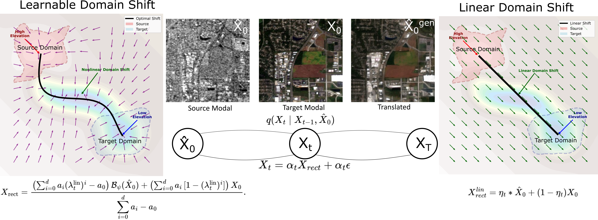
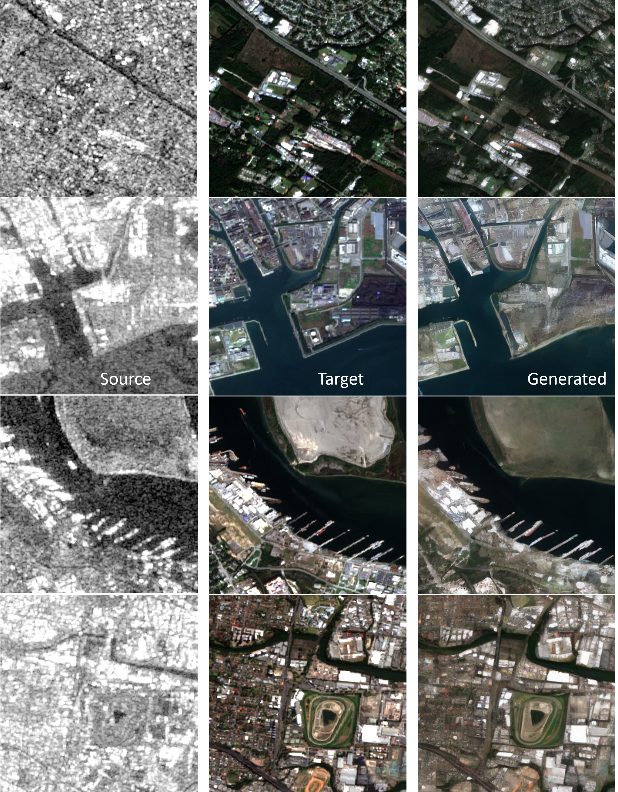
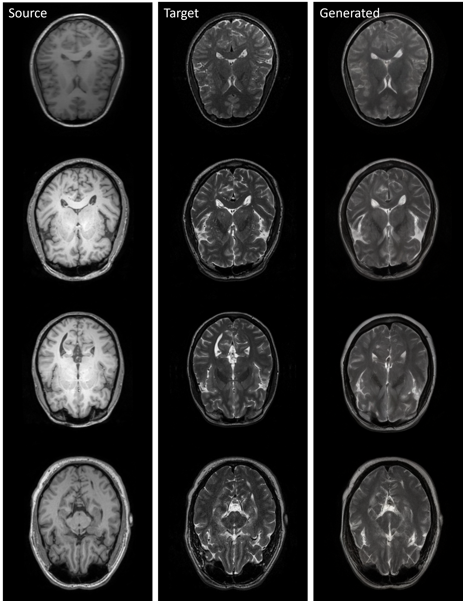
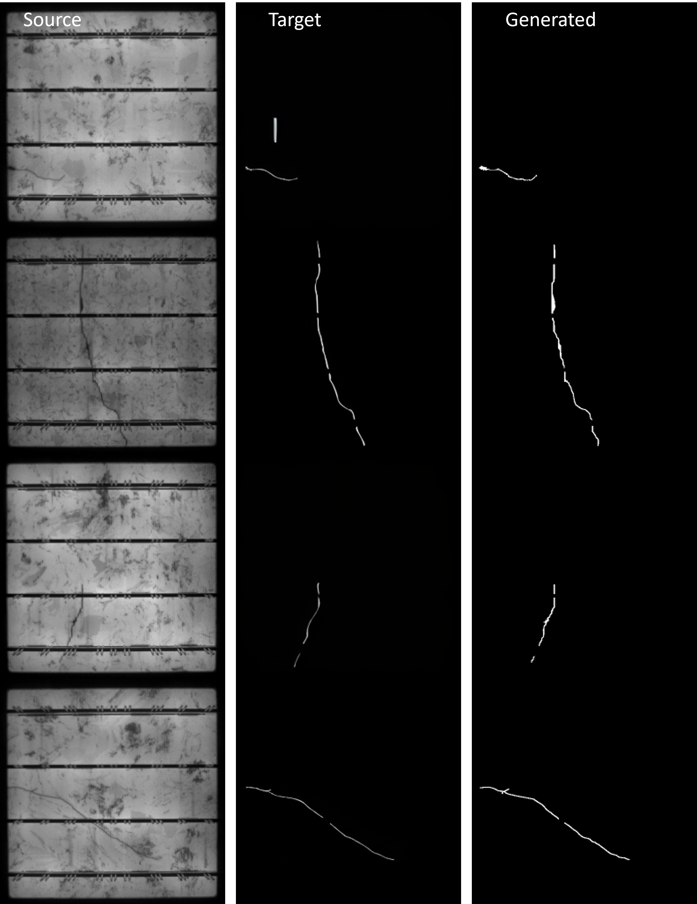

# CDTSDE

Adaptive Domain Shift in Diffusion Models for Cross-Modality Image Translation (ICLR 2026).

Paper: https://openreview.net/pdf?id=it0GTdiW9t


## Abstract
Cross-modal image translation is brittle when diffusion models rely on fixed, global schedules between domains. CDTSDE embeds domain-shift dynamics directly into the generative process by predicting a spatially varying mixing field at each reverse step and injecting an explicit target-consistent restoration term into the drift. This keeps updates on-manifold, reduces semantic drift, and enables accurate sampling with fewer denoising steps. The method improves structural fidelity and semantic consistency across medical imaging, remote sensing, and electroluminescence semantic mapping tasks.

## Method 
  
- Spatially varying, channel-aware domain mixture field `Lambda_t` at every step
- Domain shift injected into the reverse SDE drift for target-consistent updates
- Continuous-time formulation with a closed-form reverse dynamics

## Setup
- Install Python 3.10+
- Install PyTorch for your CUDA environment
- Install dependencies:

  ```bash
  pip install -r requirements.txt
  ```

## Pretrained Models
- **OpenCLIP text encoder (required)**  
  The code expects `pretrain_weights/open_clip_pytorch_model.bin`. Download it from Hugging Face:
  ```bash
  huggingface-cli download laion/CLIP-ViT-H-14-laion2B-s32B-b79K open_clip_pytorch_model.bin --local-dir pretrain_weights --local-dir-use-symlinks False
  ```

- **Torchvision weights (auto-download)**  
  `evaluation.py` uses InceptionV3 and will download weights on first run to `~/.cache/torch/hub/checkpoints`.


## Data
- Dataset lists are configured in `configs/dataset/*.yaml`
- Update list paths to point at your local data files

## Train

  ```bash
  python train.py --config configs/train_cldm_paired_dynamic.yaml
  ```

## Inference

  ```bash
  python inference.py --ckpt checkpoints/your_model.ckpt --model_config configs/model/cldm_v21_dynamic.yaml --data_config configs/dataset/paired_val.yaml --output results/
  ```

## Various Tasks

### Visual Comparison Across Tasks




### Acknowledgement
This code is based on the structures from DiffBIR, DoSSR, ControlNet and BasicSR. Thanks for their awesome work.

## Citation

  ```bibtex
  @inproceedings{
    title={Adaptive Domain Shift in Diffusion Models for Cross-Modality Image Translation},
    author={Zihao Wang and Yuzhou Chen and Shaogang Ren},
    booktitle={The Fourteenth International Conference on Learning Representations},
    year={2026},
    url={https://openreview.net/forum?id=it0GTdiW9t}
  }
  ```
